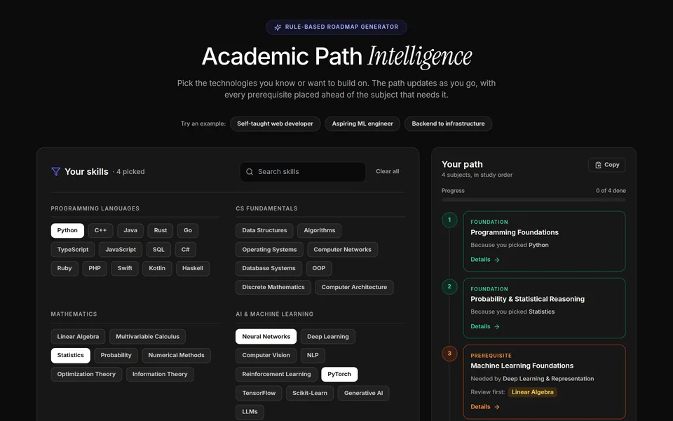
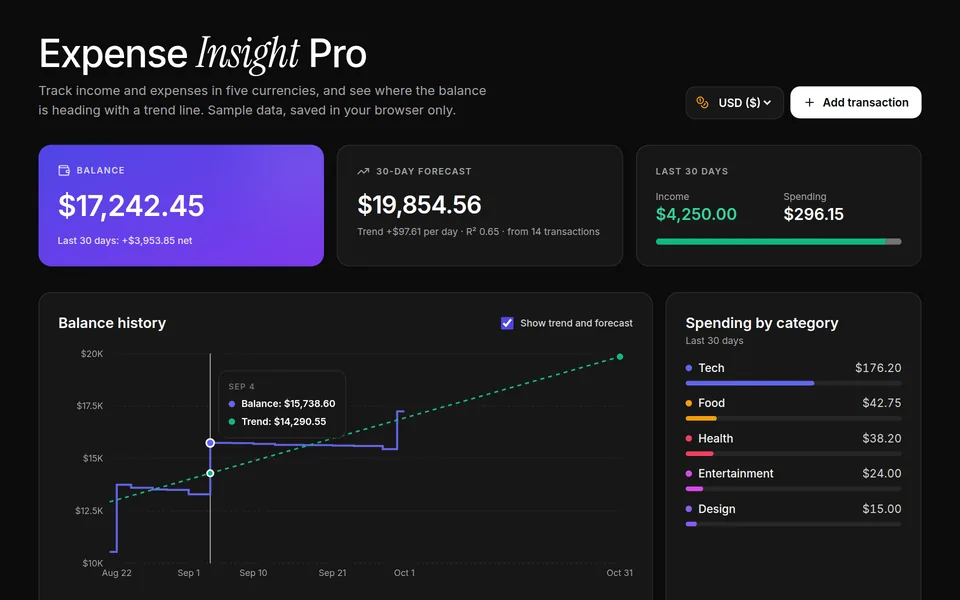
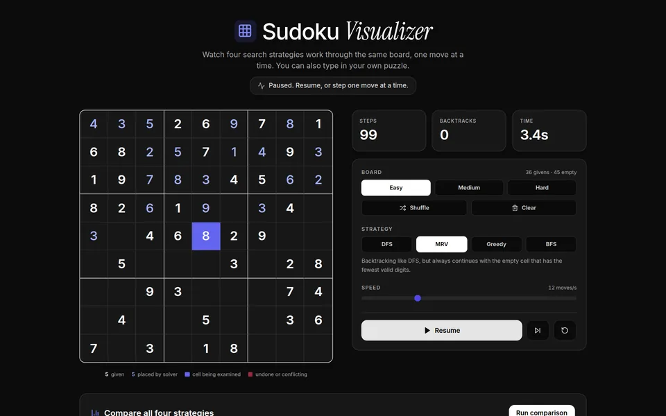

<div align="center">

# Aditya Tiwari — Portfolio

**B.Tech Computer Science student at IILM University (class of 2029), looking for a software engineering internship.**

Projects with live demos you can open right inside the page, source code, and a case study for each one.

[**Live site**](https://portfolio-website-pi-lac.vercel.app) · [GitHub](https://github.com/adityatiwari9t8) · [LinkedIn](https://www.linkedin.com/in/adityatiwari9t8) · [LeetCode](https://leetcode.com/Aditya_Tiwari_98/)


</div>

---

## The projects

Every project has a working demo embedded in the site, plus a case study (problem, what was built, trade-offs, stack) at `#/work/<id>`.

| | Project | What it does | Code |
| --- | --- | --- | --- |
|  | **Academic Path Intelligence** | Pick the skills you want to learn and it maps their prerequisites into a personalised learning roadmap. | [Repo](https://github.com/adityatiwari9t8/academic-path-intelligence) |
|  | **Expense Insight Pro** | A multi-currency expense dashboard with a 30-day balance forecast that moves as you add transactions. | [Repo](https://github.com/adityatiwari9t8/expense-insight-pro) |
|  | **Sudoku Algorithm Visualizer** | Watch DFS, BFS, greedy and MRV solve the same board, then compare steps, backtracks and time. | [Repo](https://github.com/adityatiwari9t8/sudoku-algorithm-visualizer) |

## What's in the site

- **Editorial hero.** Your name in giant condensed two-tone type, with your role and a short description below, over a dotted 3D wave drawn on a `<canvas>` (concentric rings displaced by travelling sine waves, perspective-projected, ~10k points batched by opacity). The wave follows the theme, leans gently toward the mouse, pauses off screen and holds still for reduced motion. The hero never mentions individual projects, so it scales as projects are added.
- **Embedded live demos.** Each project opens in a browser-style overlay without leaving the page.
- **Case-study pages** on a tiny hash router (`#/work/<id>`): links are shareable and the Back button closes the page.
- **Keyboard command menu (⌘K / Ctrl+K).** Jump to any section, open a demo or case study, copy the email, grab the resume or switch theme from the keyboard.
- **Restrained motion.** Scroll reveals, a gentle hover tilt on project cards, cursor-lit borders, and View Transitions for the theme switch and case-study pages. Touch screens get still cards, and everything switches off for visitors who prefer reduced motion.
- **Dark by default, with a light toggle.** The visitor's choice is remembered in `localStorage`.
- **No backend.** The contact button opens the visitor's email app, and there is a copy-email button for people without one.
- **Fonts are bundled** (Roboto Condensed for display, Roboto Mono for labels, Inter for body text), so the site makes no Google Fonts request and looks the same everywhere.
- **Optional visitor analytics.** Cookie-less and off by default (see below).

## Run it locally

```bash
git clone https://github.com/adityatiwari9t8/portfolio-website.git
cd portfolio-website
npm install
npm run dev        # http://localhost:5173
```

```bash
npm run build      # type-check, then production build into dist/
npm run preview    # serve the production build locally
```

Needs Node 18 or newer.

## How it's organised

```text
src/
├── App.tsx              page layout and section order
├── data/
│   ├── site.ts          name, email, social links, status badge
│   ├── content.ts       hero, story, education, experience, skills, call-to-action text
│   └── projects.ts      the projects and their case studies
├── components/          sections, effects (Tilt, SectionLift, Reveal, ...)
│   └── demos/           the three embedded project demos
└── lib/                 router, theme store, scroll helper, cursor light, dialog helper, view transitions
public/                  photos, project screenshots and demo videos, resume, social preview
resume/                  source of the resume PDF
```

All copy and links live in `src/data/`, so updating the site rarely means touching a component.

| To change… | Edit |
| --- | --- |
| Name, email, social links | `src/data/site.ts` |
| Hero, story, education, experience, certifications, skills | `src/data/content.ts` |
| Projects and case studies | `src/data/projects.ts` |
| Resume | edit `resume/resume.html`, open it in Chrome, Print → Save as PDF (A4, no headers) to `public/resume.pdf` |

### Adding experience, certificates or skills

Every list in `src/data/content.ts` can grow without touching a component:

- **Experience:** add an object to `EXPERIENCE`, newest first. The first three show; the rest sit behind a "Show all" button.
- **Certificates:** add an object to `CERTIFICATIONS`. Give it a `url` (opens in a new tab) or an `image` in `public/certificates/` (opens in a viewer on the page). The first six show; the rest fold away.
- **Skills:** add to any group in `TOOLKIT`, or add a whole new group (`{ label: 'Cloud', items: [...] }`). CS fundamentals live in `EDUCATION.coursework` and show in the education card. List only what you could be interviewed on.
- **Hero text:** `HERO` in `src/data/content.ts` (role, focus, the `//` line and the short intro; the name comes from `SITE`). Section numbers in the nav and headings come from `NAV` in `src/data/site.ts`.

### Adding a project

1. Add a light and a dark screenshot to `public/` (WebP, about 960 px wide).
2. Copy an object in `PROJECTS` in `src/data/projects.ts` and change its fields.
3. Fill in `study` (problem, what was built, what was learned, stack). It becomes the case-study page.
4. Add `repo` and `live` links if they exist. The buttons appear automatically.

## Deploying

The site is a plain Vite app, so Vercel needs no extra settings: import the repo, keep the framework preset on **Vite**, and every push to `main` redeploys.

- **Site address.** On Vercel the address is picked up at build time (canonical link, sitemap, absolute preview URLs). Anywhere else, set `SITE_URL=https://your-domain.com` before `npm run build`.
- **Analytics (optional).** Enable **Analytics** in the Vercel project, add the environment variable `VITE_ANALYTICS=1` and redeploy.

## Contact

**adityatiwari.connect@gmail.com** — I'm open to software engineering internships on backend, full-stack or ML-adjacent teams (remote, hybrid or on-site, anywhere).


